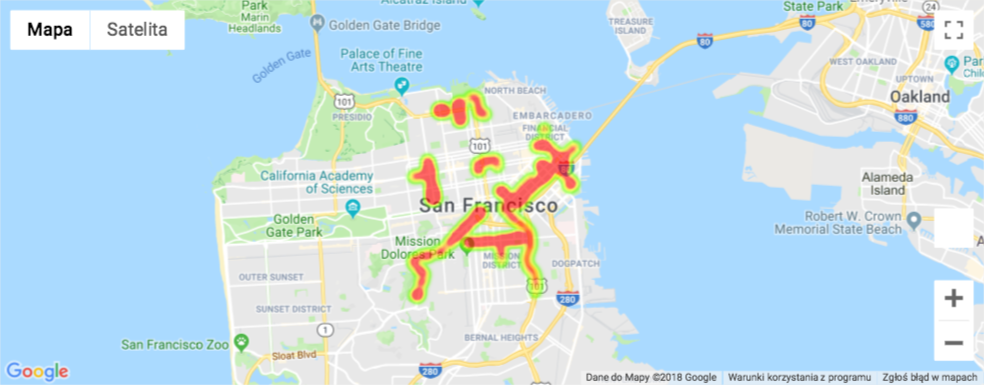

# py_data_science

install python3 if needed with:

	brew install python3

alias pip3

	alias pip3=/usr/local/Cellar/python/3.7.0/bin/pip3

python3 virtualenv

	virtualenv --python=/usr/local/Cellar/python/3.7.0/bin/python3 venv

activate it:

	source venv/bin/activate

install libs

	pip3 install --upgrade --force-reinstall --no-cache-dir  -r requirements.txt

setup kernel in jupyter to virtualenv python

	python -m ipykernel install --user --name=venv

run jupyter:

	jupyter notebook

STRAVA (gmaps)
------

in another terminal session activate virtualenv again and make sure that, when running `which jupyter`
links to the jupyter installation in virtualenv

Then tell Jupyter to load the extension with:

    jupyter nbextension enable --py --sys-prefix widgetsnbextension

    jupyter nbextension enable --py --sys-prefix gmaps

Kill jupyter notebook in previous session and go in that when nbextension commands executed

when you open gmap_us_taxi_heatmap and run the first cell you should see the heatmap like the one below:

Image detection (openCV / yolo)
------------------------------

Install opencv and img dependencies:

	brew install opencv3 --with-contrib --with-python3

	brew install cmake pkg-config

	brew install jpeg libpng libtiff openexr
	
	brew install eigen tbb

then install with pip

	pip install opencv-python